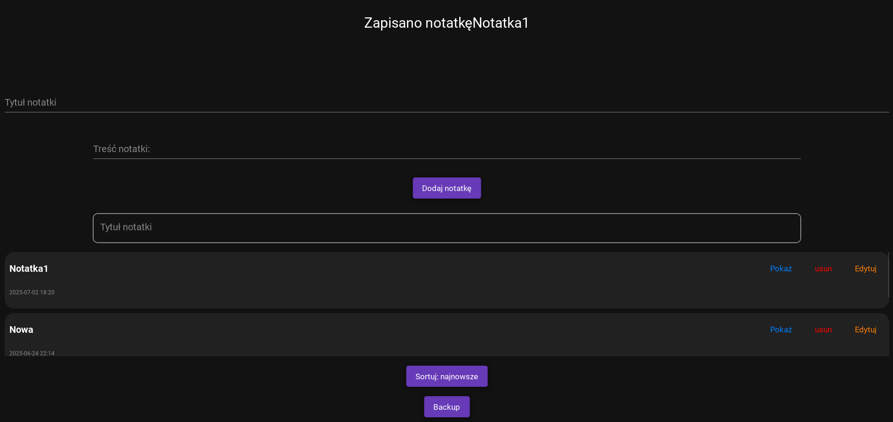

# NoteSnap
# 🗒️ NoteSnap – Mobile Notes App with KivyMD

NoteSnap is a modern mobile note-taking application built using the `KivyMD` framework. It allows users to create, edit, delete, preview, sort, and back up notes in an elegant and responsive interface.

---

## 🚀 Features

- 📝 Create and edit notes with title, content, and timestamp
- 🗃️ Scrollable list of all saved notes with action buttons
- 🔍 "Show", "Edit", and "Delete" buttons for each note
- 🔁 Sort notes by newest or oldest
- 💾 Auto-saving to local JSON file
- 🗃️ Backup notes to a dedicated folder in user's system
- 📦 Lightweight and fast app
- 🌙 Dark mode UI using `KivyMD`

---

## 📱 Technologies Used

- **Python 3**
- [`Kivy`](https://kivy.org/) – GUI framework
- [`KivyMD`](https://github.com/kivymd/KivyMD) – Material Design for Kivy
- `JSON` – for persistent note storage
- `shutil` and `pathlib` – for file backup
- `datetime` – to store creation or edit timestamps

## 📷 Screenshot

